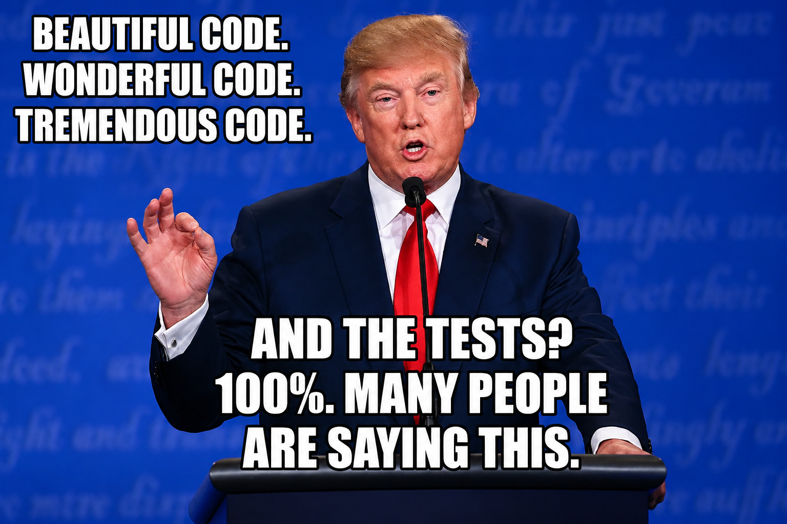

# helhest-stack

<p align="center">
  
</p>

A GPU navigation stack for the **Helhest Junior** skid-steer robot, built on
[NVIDIA Warp](https://github.com/NVIDIA/warp) and shipped as one importable
package, `helhest`. It spans the whole on-robot loop — see, sense where you are,
decide where to go:

- **`helhest.perception`** — point cloud → heightmap → traversability cost map,
  plus a lidar sim, outlier/dynamic-obstacle filtering, and occlusion/support
  trust masks. ≈5.5 ms/frame (68k-point Ouster) on a laptop RTX A500.
- **`helhest.localization`** — GPU-native ICP pose estimation over a
  device-resident rolling map accumulator.
- **motion** (`helhest.engine` / `planning` / `control` / `driver`) — a fast,
  **differentiable, purely kinematic** twin of the robot plus a sampling planner
  (GPU MPPI + orientation-aware cost-to-go routing + a terminal dock controller).

Everything is **device-resident by default**: point clouds, grids, and rollouts
live on the GPU; host↔device round trips are the exception, not the rule.

## The differentiable kinematic twin (motion core)

No Newton/Ostrich, no dynamics — a rigid tripod resolved kinematically:

- **Controlled DOF** `(x, y, yaw)` — driven by the 3 wheels via no-slip
  differential-drive kinematics, with friction-dependent turning captured by two
  ICR parameters `(alpha, x_ICR)` derived from a per-cell friction field.
- **Derived DOF** `(z, pitch, roll)` — from a quasi-static settle against a
  heightmap: an analytic 3×3 Newton solve (wheels grounded). Chassis
  non-penetration is a post-check (high-centering rejects a trajectory, it isn't
  resolved by lifting a wheel).

Differentiable w.r.t. the **raw heightmap** `h` and the **friction field** `mu`,
via a hand-written implicit (IFT) adjoint through the settle. The wheel-envelope
dilation is recorded on the tape (arg-max contact off-tape, gather on-tape), so
gradients flow all the way to the *raw* elevation. Controls are **not**
differentiated. Batched over many rollouts for sampling-based planning and for
per-episode calibration.

Two simulators share a `BaseSimulator` (device structs, grid, buffer allocation):

- **`ForwardSimulator`** — the planner's workhorse: one fused `rollout_kernel` over
  `B` rollouts × `T` steps (graph-capturable, no host I/O, no gradients). CPU/CUDA.
- **`DifferentiableSimulator`** — calibration: a taped per-step rollout with
  per-rollout `[B, ny, nx]` terrain, so each episode calibrates its own grid.
  Gradients land in `elevation.grad` / `friction.grad`. A scalar-loss path
  (`rollout_taped(loss_fn) → backward()`) and a VJP path for framework bridges
  (`rollout_taped(loss_fn=None) → backward_from_cotangents(dL/dcontrolled, dL/dderived)`).
  CUDA-only (the dilation contact uses a shared-memory tiled arg-max).

## The perception → planning seam

Perception produces a `GridMap` — the deliberately minimal heightmap contract
(`helhest.perception.gridmap`). The planner consumes it via
`helhest.perception.grid_adapter` → the engine's `GridParams`, zero-copy when the
elevation is already a `wp.array`. `helhest.localization` closes the loop by
tracking the robot's pose (ICP) as it drives, so the map the planner routes over
stays registered to the world.

## Package layout (`src/helhest/`)

| module | role |
|---|---|
| `perception/` | point cloud → `heightmap/` → `traversability/` cost map; trust masks (`confidence/`), `outlier/` + `dynamic/` filters, lidar `sim/`, `pipeline.py`; the planning seam (`gridmap.py` contract, `grid_adapter.py`, `terrain_lidar.py`) |
| `localization/` | GPU ICP pose estimation (`localizer.py`, `pose_math.py`) over `perception.icp` + the rolling `perception.mapping.DeviceMapAccumulator` |
| `engine/` | Warp runtime — `simulator.py` (the 3 sims), `step.py` (settle + IFT adjoint, step kernels), `envelope.py` (wheel dilation), `terrain.py`, `robot.py` |
| `planning/` | `costtogo.py` (orientation-aware routing), `lattice_solver.py` |
| `control/` | `mppi.py` (GPU MPPI), `terminal.py` (terminal dock) |
| `driver.py` | `WarpDriver` — the single driven robot (B=1, T=1) |
| `reference/` | numpy finite-difference oracle (verification only) |
| `viz/` | Blender rollout export/import + interactive viewers |
| `worlds.py`, `dynamics.py` | stress scenes + canonical robot/solver params |

Robot geometry/mass come from `dynamics.robot_params()` (`engine/robot.py`
`RobotParams`); `data.py` loads rosbags for calibration/eval.

## Install

```bash
uv sync                              # core (numpy + warp-lang)
uv sync --extra viz --extra data     # + viewers (glfw/PyOpenGL/matplotlib) + rosbag loader (h5py)
```
or plain pip: `pip install -e ".[viz,data]"`.

## Run

```bash
# --- motion: closed-loop planning on the real driver (MPPI + cost-to-go + terminal dock)
python demos/eval.py --world pocket           # one world
python demos/eval.py --stress                 # all stress worlds
python demos/navigate_partial.py              # plan on a lidar-built map, fixed robot window
python demos/navigate_partial_view.py         # same drive from both planners' viewpoints
python demos/motor_lag_comparison.py          # first-order wheel actuator lag: tau=0 vs tau>0

# --- perception (all synthetic — no data files needed)
python scripts/example.py                     # end-to-end pipeline on synthetic points
python scripts/drive_lidar.py                 # interactive: drive an Ouster OSDome, filter moving people
python scripts/demo_lidar.py                  # animated ray-cast lidar watching a person walk
python scripts/demo_dynamic_filter.py         # filter a moving person out of the accumulated map

# --- localization / mapping
python scripts/stress_icp_odom.py             # accumulating mapper vs noisy odometry
python scripts/stress_deskew.py               # quantify + correct lidar motion skew

# --- timing benchmarks (CUDA)
python -m benchmarks.forward                  # ForwardSimulator fused rollout
python -m benchmarks.differentiable           # DifferentiableSimulator grad-step
python -m benchmarks.planning                 # cost-to-go solve
python -m benchmarks.control                  # MPPI replan

# --- verify the engine (parity oracles)
python -m tests.engine.step                   # full physics vs numpy oracle (incl. motor-lag parity)
python -m tests.engine.gpu_check              # forward / adjoint / VJP parity + throughput
python -m tests.engine.gradients              # implicit-gradient finite-diff oracle
```

## Blender visualization

Export a rollout to a self-contained `.npz`, then animate it in Blender — the
heightmap becomes a mesh and the robot's 6-DOF pose + per-wheel spin are keyframed.

```bash
# 1. run a rollout and write the .npz (a straight climb up the ramp scene)
python -m helhest.viz.blender_export rollout.npz

# 2a. build the scene (box+cylinder proxy robot) and open it in Blender
blender --python src/helhest/viz/blender_import.py -- --data rollout.npz

# 2b. headless render straight to MP4 (PNG sequence if Blender lacks FFMPEG)
blender --background --python src/helhest/viz/blender_import.py -- \
    --data rollout.npz --render out.mp4

# 2c. drive your own rigged model (a .blend with separate wheel objects)
blender --python src/helhest/viz/blender_import.py -- --data rollout.npz \
    --robot robot.blend \
    --wheel-left WheelL --wheel-right WheelR --wheel-rear WheelRear
```

Frame convention is the sim's: X-forward, Y-left, Z-up, meters/radians; wheels spin
about body Y (`--wheel-axis`). A rigged model is appended whole (hierarchy + materials)
and auto-aligned: the animation root is placed at the front-axle hub center (mean of the
left/right wheels), matching the sim's pose origin, so no manual offset/scale is needed.
The 10 Hz sim is interpolated to `--fps` (default 30) for smooth playback.

### Remote GPU render (dasenka)

`scripts/render_dasenka.sh` ships the script + `.npz` (+ a local `--robot` model) to a
remote box, renders headless on a pinned GPU (`VK_DEVICE_INDEX` + Vulkan/EEVEE), encodes
to MP4 there, and copies it back:

```bash
OUT=~/clip.mp4 RES=1920x1080 ./scripts/render_dasenka.sh rollout.npz <gpu> -- \
    --robot robot.blend --wheel-left WheelL --wheel-right WheelR --wheel-rear WheelRear
```

## Motion core — build phases

Built in phases, each independently verifiable:

| Phase | Content | Verify | Status |
|-------|---------|--------|--------|
| 0 | scaffold, heightmap rasterizer + bilinear sampler, rosbag loader | height under wheel matches scene; run loads | ✅ |
| 1 | flat-ground forward twist, scalar `(alpha, x_ICR)` | reproduces ~0.40 m/s cruise on run 18_04_51 | ✅ |
| 2 | heightmap settle, wheels grounded, normal loads `N_i`, sphere-wheel envelope | flat→level; ramp→pitched; loads=scaled meas.; box climbs | ✅ |
| 3 | chassis non-penetration = post-check → high-center ⇒ reject trajectory (`valid`) | benign→valid; tall block→high-center w/ depth | ✅ |
| 4 | per-cell `mu` field + grip-weighted ICR turning map | uniform→`1+k·mu`/CoM_x; slippery rear turns more; signs correct | ✅ |
| 5 | implicit gradients (`d/dh`, `d/dmu`), BPTT + VJP boundary | finite-diff check ~2e-5; VJP == scalar-loss backward | ✅ |
| 6 | calibration vs rosbags | RMSE ≤ full-physics bar; cross-run | ⬜ (gradient path ready: `DifferentiableSimulator`) |
| 7 | speed benchmarks | forward throughput; calibration grad-step cost | ✅ (`benchmarks/`) |
| 8 | planning demo (MPPI + cost-to-go) | reaches goal, avoids high-center | ✅ (`demos/eval.py`) |

## Known limitations

- **Spherical wheel is laterally too fat (near walls).** `engine/envelope.py`
  inflates the terrain by an *isotropic* disk of radius R, so the wheel is modeled
  as a sphere. R is only correct in the rolling plane (body X–Z); across the axle
  (body Y) the real wheel is thin (half-width 0.05 m, ~7× narrower). Effect: the
  robot "feels" walls up to R≈0.35 m to its side and acts ~1.4 m wide instead of
  ~0.83 m, so it cannot hug walls or thread narrow gaps. Fine for open/gentle
  terrain (current scenes). **Fix when wall-navigation is needed:** anisotropic
  thin-cylinder wheel contact (cap radius R only in the rolling direction, thin
  across the axle, evaluated per-step in the body frame since it's yaw-dependent),
  and/or treat walls as obstacles via a separate 2D thin-footprint clearance check
  (heightmap = traversable ground only). Both slot in at the dilation + a new
  in-plane clearance without disturbing the rest.
- **High-center is detection-only, by design** (Phase 3): belly non-penetration is
  not *enforced* (wheels stay grounded). A high-centering trajectory is **rejected**
  via the `valid` flag, not resolved by lifting a wheel. This keeps the settle a
  clean wheels-only 3×3 equality solve (no chassis complementarity), which in turn
  keeps the implicit (IFT) gradient simple.

## Docs

`docs/` holds the perception reference (heightmap, outlier filtering,
traversability, pipeline, performance), built with mkdocs.

## License

MIT — see [LICENSE](LICENSE).
